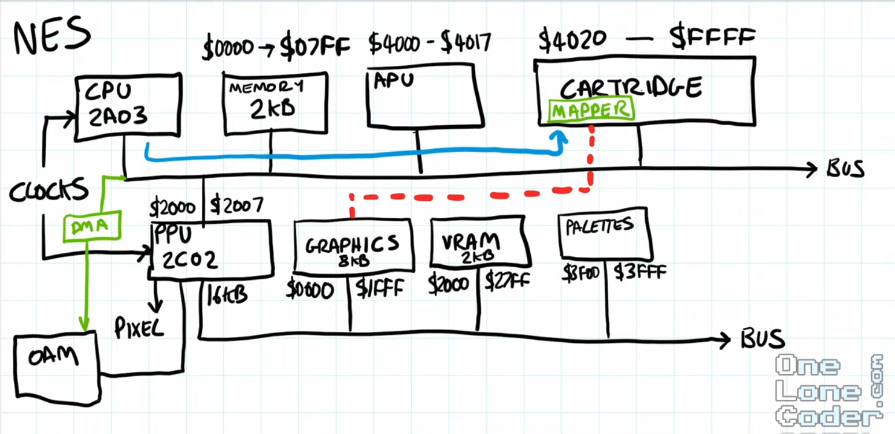

# References

## Altera DE1 User Manual
- Creator: Terasic
- Source: [DE1 User Manual](https://www.terasic.com.tw/cgi-bin/page/archive.pl?Language=English&CategoryNo=183&No=83&PartNo=4#contents)
- Description: Manual do usuário da placa FPGA Altera DE1.
- Local file: [DE1_UserManual_v1018](./DE1_UserManual_v1018.pdf)

## Nes Memory Map Overview
- Creator: [javidx9](http://www.youtube.com/@javidx9)
- Source: [NES Emulator Part #1: Bitwise Basics & Overview](https://youtu.be/F8kx56OZQhg?si=yS212hxrHIoQivDO&t=2253)
- Timestamp: 00:37:33
- Description: Visão geral dos barramentos da CPU e PPU, regiões de memória e conexões entre componentes.
- Local file: [nes_memory_map_overview.png](./nes_memory_map_overview.png)

